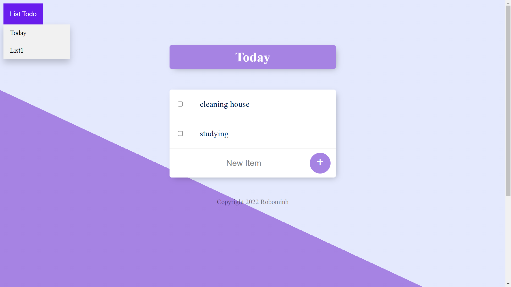

# TodoList App

## Installation 
### Install NodeJS
- I used NodeJS for a backend. There is a lot of advantages of using NodeJS such as faster development, building fast, scalable, high performance,...
- Check out this [official website](https://nodejs.org/en/) for download NodeJS. I use version **16.14.0** at the time building this application.
- Remember to add NodeJS to the path when install.

### Install package
All the package using in this app is store in package.json
``` powershell
# install a package using npm
npm i
```

### Install database
- In here, i use MongoDB for database. You need to install [MongoDB](https://www.mongodb.com/try/download/community?tck=docs_server) for continue. In this project I use version **5.0.6**.

- You might need to add mongo to the path for using it. Feel free to check this [tutorial](https://www.c-sharpcorner.com/article/how-to-set-up-and-starts-with-mongodb/#:~:text=Click%20on%20environment%20variables%20button,Program%20Files%5CMongoDB%5C%E2%80%9D.) if you do not know how to do this.

## Running
- When you want to run this app. Please run this command:
``` powershell
node app.js
```
- You can see something like:
```
Server is running on port 8080
```
- Then you can go to browser to see this application and play with it:
```
localhost:8080
```
- Here is the overall of this app:



## Functionalities
- Add and delete item for a todo list.
- Create a new todo list:
```
localhost:8080/[name-of-todoList]
```
- Navigate between each todo list.
